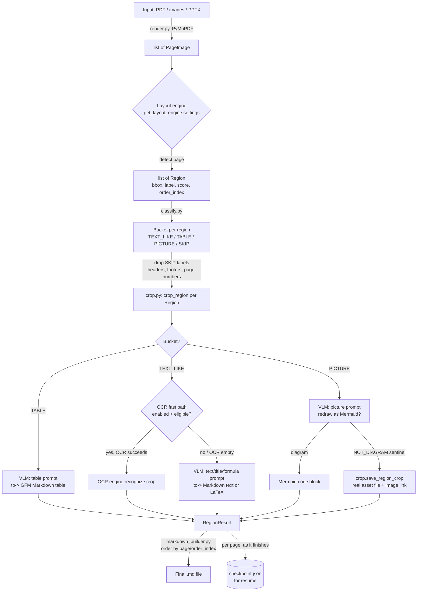
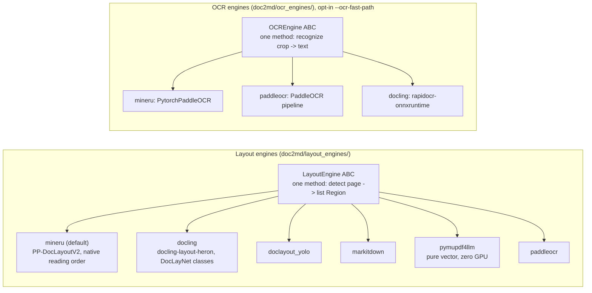
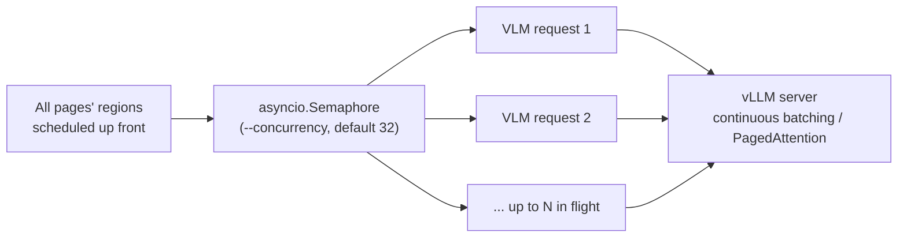

# doc2md Architecture

This is a snapshot of how `doc2md` actually works right now (2026-08-12), not
an aspirational design. Where something is claimed but not actually verified,
that's called out explicitly rather than glossed over.

## 1. What kind of architecture this is

**Yes — this is a multi-step, region-level pipeline, not a single whole-page
VLM call.** Concretely:

1. A dedicated **layout-detection model** first finds every distinct region
   on a page (title, paragraph, table, figure, formula, ...) with a bounding
   box and a label.
2. Each region is **cropped out individually** and sent to the VLM
   **separately**, with a prompt tailored to that region's type (a table
   region gets a "produce a GFM table" prompt; a picture region gets a
   "redraw as Mermaid or say NOT_DIAGRAM" prompt; text gets a transcription
   prompt).
3. The per-region outputs are **stitched back together** in reading order to
   produce the final Markdown.

This is the higher-accuracy approach relative to feeding the VLM one giant
image of the whole page and asking for the whole page's Markdown in one
shot: the model never has to simultaneously track "is this a table or a
paragraph," "did I preserve every row," and "is this figure a diagram or a
photo" all at once across a large, visually busy image. Each call has one
job, on a small, focused crop. The cost is latency and request volume — one
document produces as many VLM calls as it has regions (a real 97-slide PPTX
in this repo produced 445 region-level VLM calls), not one call per page.

## 2. Pipeline diagram

Every VLM call in this diagram (H, K, L) goes through
`AsyncVLLMClient.ask()` in `doc2md/vlm_client.py`, which as of the latest
commit also retries and truncates decoding-loop garbage — see §6.

## 3. Pluggable subsystems

Two stages are pluggable via an ABC + registry, so a new engine can be added
without touching the pipeline itself:

All 6 layout engines share common helpers in `layout_engines/base.py`:
`make_region()` (label -> bucket -> `Region`), `finalize_regions()`
(dedup + reading order for every engine except `mineru`, which has its own
native reading-order head), and `safe_detect()` (one consistent failure
policy: an exception or zero regions falls back to a synthesized full-page
region instead of aborting).

**Only 3 of the 6 layout engines bundle their own OCR model** (mineru,
paddleocr, docling) — the other 3 (doclayout_yolo, markitdown, pymupdf4llm)
have no OCR fast path and always go through the VLM for `TEXT_LIKE` regions
regardless of the `--ocr-fast-path` flag. Titles and formulas always go to
the VLM under every engine — OCR can't produce a Markdown heading or LaTeX.

## 4. Concurrency model

Every region's VLM call is fired concurrently, gated by one process-wide
semaphore (`settings.vlm_max_concurrency`, `--concurrency`, default **32**)
shared across every page — not per-page, so cross-page concurrency is
unaffected by page boundaries. A single region's VLM failure
(timeout, transient server error) is caught in `_process_region_safe_async`
and becomes an inline `> **doc2md: failed to extract...**` note rather than
aborting the whole document. CPU-bound crop/detect work runs in a separate
`ThreadPoolExecutor`, sized independently at
`min(vlm_max_concurrency, os.cpu_count())` so it can't scale past the
machine's real core count just because `--concurrency` is set high.

**Tested at real-document scale (2026-08-12):** the same 508-region PPTX
run three times at `--concurrency 32`/`64`/`128` against the live tuned
server produced extraction times of 112s/116s/114s — statistically
indistinguishable. In every run the last ~8 regions took ~30s+ regardless
of the concurrency setting, dominating wall time far more than the
concurrency knob did — a handful of individually slow completions (long
regions near `vlm_max_tokens`, occasional decoding-loop retries), not
client-side fan-out, is the real bottleneck at this scale. **32 (the
default) is already enough to keep the server's continuous batching fed;
raising it doesn't help until the slow-tail regions themselves are
addressed.**

## 5. Resumability

`pipeline.py` checkpoints per-page results to
`<output>/<name>.doc2md_progress.json` incrementally, as each page's regions
finish (`asyncio.as_completed` over per-page task groups) — a crash mid-run
only loses whichever pages hadn't finished yet. On resume, layout detection
itself is also skipped for already-checkpointed pages. The checkpoint is
keyed by a fingerprint (resolved input path, layout engine, DPI, total page
count); if any of those change, the checkpoint is considered stale and
ignored. Deleted on successful completion.

## 6. VLM decoding-loop guard (added 2026-08-12)

A real 445-region PPTX run showed the vLLM/Gemma-4 backend can fall into a
repetition loop on ambiguous or visually cluttered crops instead of
terminating normally, at `doc2md`'s near-greedy `vlm_temperature=0.1`.
`AsyncVLLMClient.ask()` now: sends a `repetition_penalty` (default `1.15`,
vLLM-specific), detects a degenerate response after the fact
(`_looks_degenerate()`), retries up to twice with the penalty escalated, and
if still degenerate, truncates at the loop and appends a visible note
instead of silently keeping garbage. This only catches *repetition*-shaped
degeneracy — a fluent-but-wrong response that doesn't loop is not caught by
anything in this pipeline.

## 7. Honest testing/benchmark status per layout engine

This is the answer to "have all layout engines been tested end-to-end and
benchmarked against each other" — checked against the actual repo history
in `CLAUDE.md` and `handoffs/`, not assumed:

| Engine | Implemented | Run end-to-end (real doc -> real Markdown via a live VLM) | Benchmarked vs. the others |
|---|---|---|---|
| `mineru` (default) | yes | **yes** — a 1-page synthetic doc, a 97-slide real PPTX (445 regions), and a real multi-page PDF | no |
| `docling` | yes | **no** — only its `detect()`-level output was checked in a code audit, never a full VLM conversion | no |
| `doclayout_yolo` | yes | **no** — detection-only check; a real formula-routing bug was found by *reading* the code, not by running it | no |
| `markitdown` | yes | **no** — this is the engine whose `resolve_source_pdf()` cwd-relative-path bug silently disabled its real PDF extraction for months, only caught by code audit | no |
| `pymupdf4llm` | yes | **no** for a full VLM run — it did get one targeted detection-only re-run to confirm/fix an OCR-dependency regression | no |
| `paddleocr` | yes | **no** — no record of it ever being run | no |

**No cross-engine benchmark/comparison harness exists anywhere in this
repo.** The only thing named "benchmark" (`benchmark/`) is a completely
separate, self-contained harness for llama.cpp-vs-vLLM raw GPU decode
throughput — it has nothing to do with layout-engine accuracy or speed
comparison. If you want that, it doesn't exist yet and would need to be
built from scratch: running the same real document through all 6 engines,
comparing region counts/labels/bounding boxes against a ground truth, and
timing each.

**Bottom line: only the default engine (`mineru`) has real-world evidence
behind it.** The other 5 are implemented and pass detection-level checks,
but "implemented and unit-checked" is a different, weaker claim than
"actually run end-to-end" — this exact distinction has already caused a
real, months-long silent bug once in this repo (`resolve_source_pdf()`), so
it's worth taking seriously rather than assuming the other 5 engines work
in practice just because their code looks right.
